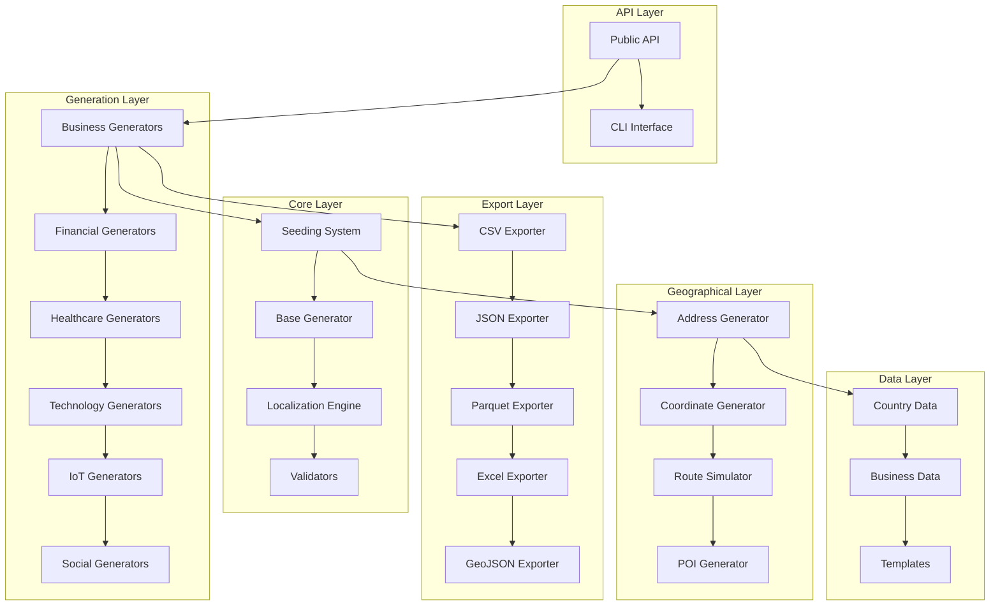

# TempData Library Design Document

## Overview

TempData is architected as a modular Python library that generates realistic fake data through a combination of time-based seeding, geographical intelligence, and domain-specific data generators. The design emphasizes performance, extensibility, and global coverage while maintaining simplicity in the public API.

The core architecture follows a layered approach:
- **API Layer**: Simple public interface and CLI
- **Generation Layer**: Dataset-specific generators with realistic patterns
- **Core Layer**: Seeding, localization, and base functionality
- **Data Layer**: Static reference data for realism
- **Export Layer**: Multiple format support with optimized serialization

## Architecture

### High-Level System Architecture



### Core Seeding System Design

The time-based seeding system is the foundation of TempData's uniqueness and reproducibility:

```python
class MillisecondSeeder:
    def __init__(self, fixed_seed=None):
        if fixed_seed:
            self.seed = fixed_seed
        else:
            # Millisecond precision ensures uniqueness
            self.seed = int(time.time() * 1000) % (2**32)
        
        random.seed(self.seed)
        self.base_time = time.time()
        self._context_seeds = {}
    
    def get_contextual_seed(self, context: str) -> int:
        """Generate consistent seed for specific contexts"""
        if context not in self._context_seeds:
            context_hash = hashlib.md5(f"{self.seed}_{context}".encode()).hexdigest()
            self._context_seeds[context] = int(context_hash[:8], 16) % (2**31)
        return self._context_seeds[context]
    
    def get_temporal_seed(self, offset_seconds: int = 0) -> int:
        """Generate seed with time offset for time series"""
        time_offset = int((self.base_time + offset_seconds) * 1000)
        return time_offset % (2**32)
```

### Generator Hierarchy Design

All dataset generators inherit from a common base class that provides seeding, localization, and validation:

```python
class BaseGenerator:
    def __init__(self, seeder: MillisecondSeeder, locale: str = 'en_US'):
        self.seeder = seeder
        self.locale = locale
        self.faker = Faker(locale)
        self.faker.seed_instance(seeder.get_contextual_seed(self.__class__.__name__))
    
    def generate(self, rows: int, **kwargs) -> pd.DataFrame:
        """Abstract method implemented by specific generators"""
        raise NotImplementedError
    
    def _apply_realistic_patterns(self, data: pd.DataFrame) -> pd.DataFrame:
        """Apply domain-specific realistic patterns"""
        return data
    
    def _validate_data(self, data: pd.DataFrame) -> bool:
        """Validate generated data meets quality standards"""
        return True
```

## Components and Interfaces

### 1. Public API Interface

The main entry point provides a simple, intuitive interface:

```python
# Primary API functions
def create_dataset(filename: str, rows: int = 500, **kwargs) -> str:
    """Generate single dataset with specified parameters"""
    
def create_batch(datasets: List[Dict], **kwargs) -> List[str]:
    """Generate multiple related datasets"""
    
def geo.addresses(country: str, count: int) -> List[Dict]:
    """Generate geographical addresses"""
    
def geo.route(start_city: str, end_city: str, waypoints: int = 0) -> Dict:
    """Generate route with waypoints"""
```

### 2. Dataset Generator Components

Each domain has specialized generators that understand realistic patterns:

**Business Generators:**
- SalesGenerator: Seasonal trends, regional preferences, payment method distributions
- CustomerGenerator: Demographic distributions, registration patterns
- EcommerceGenerator: Order patterns, shipping preferences, product correlations

**Financial Generators:**
- StockGenerator: Market volatility, trading volumes, sector correlations
- BankingGenerator: Transaction patterns, account behaviors, fraud indicators
- CryptoGenerator: Price volatility, trading volumes, market cap relationships

**Healthcare Generators:**
- PatientGenerator: Demographic distributions, medical history correlations
- AppointmentGenerator: Scheduling patterns, doctor availability, seasonal trends

### 3. Geographical Intelligence System

The geographical system provides worldwide coverage with local accuracy:

```python
class GeographicalEngine:
    def __init__(self, country_data_path: str):
        self.countries = self._load_country_data()
        self.cities = self._load_city_data()
        self.postal_systems = self._load_postal_data()
    
    def generate_address(self, country: str) -> Dict:
        """Generate realistic address for specified country"""
        country_config = self.countries[country]
        return {
            'street': self._generate_street(country_config),
            'city': self._select_city(country),
            'postal_code': self._generate_postal_code(country),
            'coordinates': self._get_coordinates(country, city)
        }
```

### 4. Export System Architecture

The export system supports multiple formats with optimized serialization:

```python
class ExportManager:
    def __init__(self):
        self.exporters = {
            'csv': CSVExporter(),
            'json': JSONExporter(),
            'parquet': ParquetExporter(),
            'excel': ExcelExporter(),
            'geojson': GeoJSONExporter()
        }
    
    def export(self, data: pd.DataFrame, formats: List[str], filename: str):
        """Export data in specified formats"""
        for format_type in formats:
            exporter = self.exporters[format_type]
            exporter.export(data, f"{filename}.{format_type}")
```

## Data Models

### Core Data Structures

**Dataset Configuration:**
```python
@dataclass
class DatasetConfig:
    name: str
    rows: int
    country: str = 'global'
    date_range: Tuple[str, str] = None
    time_series: bool = False
    interval: str = '1day'
    seed: int = None
    formats: List[str] = field(default_factory=lambda: ['csv'])
    custom_params: Dict = field(default_factory=dict)
```

**Geographical Data Model:**
```python
@dataclass
class Address:
    street: str
    city: str
    state_province: str
    postal_code: str
    country: str
    coordinates: Tuple[float, float]
    
@dataclass
class Route:
    start_point: Address
    end_point: Address
    waypoints: List[Address]
    distance_km: float
    estimated_time_minutes: int
```

**Time Series Configuration:**
```python
@dataclass
class TimeSeriesConfig:
    start_date: datetime
    end_date: datetime
    interval: str  # '1min', '5min', '1hour', '1day'
    seasonal_patterns: bool = True
    trend_direction: str = 'random'  # 'up', 'down', 'random'
    volatility_level: float = 0.1
```

### Dataset-Specific Models

Each dataset type has its own data model that defines realistic field relationships:

```python
# Sales Transaction Model
@dataclass
class SalesTransaction:
    transaction_id: str
    date: datetime
    customer_id: str
    product_id: str
    amount: Decimal
    region: str
    payment_method: str
    
    def __post_init__(self):
        # Apply realistic constraints
        if self.payment_method == 'cash' and self.amount > 500:
            self.payment_method = 'card'  # Large cash transactions are rare
```

## Error Handling

### Error Classification System

**Data Generation Errors:**
- `InvalidParameterError`: Invalid configuration parameters
- `DataQualityError`: Generated data fails quality checks
- `GeographicalError`: Invalid geographical constraints
- `MemoryError`: Insufficient memory for large datasets

**Export Errors:**
- `ExportFormatError`: Unsupported export format
- `FileSystemError`: File system access issues
- `SerializationError`: Data serialization failures

### Error Recovery Strategies

```python
class ErrorHandler:
    def handle_generation_error(self, error: Exception, config: DatasetConfig):
        if isinstance(error, MemoryError):
            # Switch to streaming generation
            return self._stream_generate(config)
        elif isinstance(error, DataQualityError):
            # Regenerate with adjusted parameters
            return self._regenerate_with_fallback(config)
        else:
            raise error
    
    def _stream_generate(self, config: DatasetConfig):
        """Generate data in chunks to manage memory"""
        chunk_size = min(10000, config.rows // 10)
        chunks = []
        for i in range(0, config.rows, chunk_size):
            chunk_config = replace(config, rows=min(chunk_size, config.rows - i))
            chunks.append(self._generate_chunk(chunk_config))
        return pd.concat(chunks, ignore_index=True)
```

## Testing Strategy

### Unit Testing Approach

**Generator Testing:**
- Test each generator produces expected column structure
- Verify data types and constraints are respected
- Validate realistic patterns are applied
- Test seeding reproducibility

**Integration Testing:**
- Test cross-dataset relationships in batch generation
- Verify geographical accuracy across countries
- Test export format consistency
- Validate performance benchmarks

**Property-Based Testing:**
Using Hypothesis for robust testing:

```python
from hypothesis import given, strategies as st

@given(
    rows=st.integers(min_value=1, max_value=10000),
    country=st.sampled_from(['united_states', 'pakistan', 'germany']),
    seed=st.integers(min_value=1, max_value=2**31)
)
def test_sales_generator_properties(rows, country, seed):
    config = DatasetConfig(name='sales', rows=rows, country=country, seed=seed)
    data = SalesGenerator().generate(config)
    
    assert len(data) == rows
    assert all(data['amount'] > 0)  # All amounts should be positive
    assert data['region'].nunique() <= 10  # Reasonable number of regions
```

### Performance Testing

**Benchmarking Framework:**
- Measure generation speed for different dataset sizes
- Monitor memory usage during large dataset creation
- Test concurrent generation performance
- Validate export performance across formats

**Quality Assurance:**
- Automated data quality scoring
- Geographical accuracy validation
- Realistic pattern detection
- Cross-dataset relationship verification

### Load Testing

```python
def test_large_dataset_generation():
    """Test generation of 1M+ row datasets"""
    config = DatasetConfig(name='sales', rows=1_000_000)
    
    start_time = time.time()
    start_memory = psutil.Process().memory_info().rss
    
    data = generate_dataset(config)
    
    end_time = time.time()
    end_memory = psutil.Process().memory_info().rss
    
    # Performance assertions
    assert (end_time - start_time) < 20  # Should complete in under 20 seconds
    assert (end_memory - start_memory) < 50 * 1024 * 1024  # Under 50MB memory increase
    assert len(data) == 1_000_000
```

## Performance Optimization

### Memory Management

**Streaming Generation:**
For large datasets, implement streaming generation to manage memory:

```python
def stream_generate(config: DatasetConfig) -> Iterator[pd.DataFrame]:
    """Generate data in memory-efficient chunks"""
    chunk_size = min(50000, config.rows // 20)
    
    for i in range(0, config.rows, chunk_size):
        chunk_rows = min(chunk_size, config.rows - i)
        yield self._generate_chunk(chunk_rows, config)
```

**Lazy Loading:**
Load reference data only when needed:

```python
class LazyDataLoader:
    def __init__(self):
        self._country_data = None
        self._business_data = None
    
    @property
    def country_data(self):
        if self._country_data is None:
            self._country_data = self._load_country_data()
        return self._country_data
```

### Caching Strategy

**Reference Data Caching:**
- Cache frequently used geographical data
- Cache compiled regex patterns for validation
- Cache faker instances per locale

**Generation Caching:**
- Cache intermediate calculations for time series
- Cache geographical lookups within sessions
- Cache validation results for similar configurations

### Parallel Processing

**Multi-threading for I/O:**
- Parallel export to multiple formats
- Concurrent geographical data loading
- Parallel validation processes

**Vectorized Operations:**
- Use NumPy vectorized operations where possible
- Leverage Pandas vectorized string operations
- Implement vectorized date/time generation

This design provides a robust, scalable foundation for the TempData library that can efficiently generate realistic fake data at scale while maintaining simplicity in the public API.